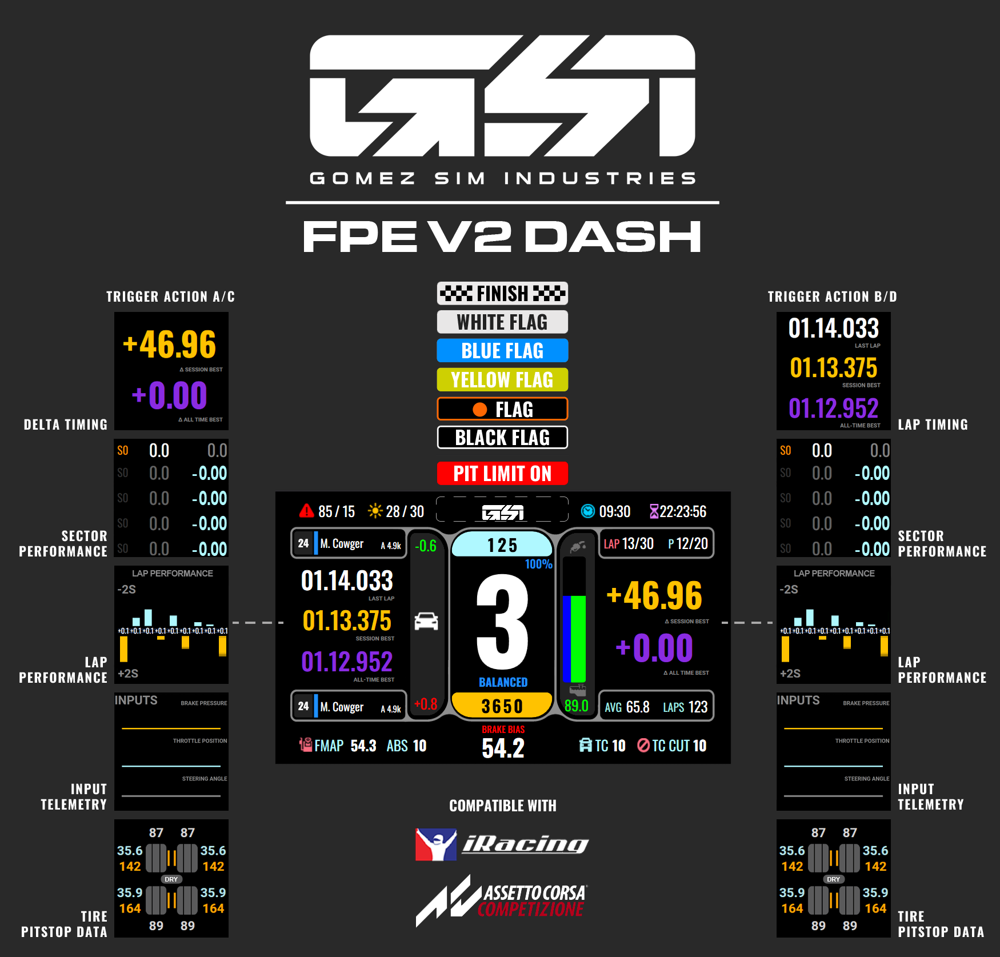

# gsi-simhub-assets
GSI Specific Simhub Items

* archives: Previous iteration items for the original FPE
* fpe-v2-dash-release: Currently Released version of the FPEV2 Stock Simhub Dash
* fpe-v2-dash-beta: Public Beta version(s) of the FPEV2 Stock Simhub Dash

## Installation:

1. Install the SimHub dash as normal (double click the `.simhubdash`` file)
2. Optional, but highly recommended.  Install the [iRacing Extra Properties Plugin](https://drive.google.com/drive/folders/1AiIWHviD4j-_D-zgRrjJU1AFhJ_xmass?usp=sharing) (you just need the first one on that page).   Place it in your SimHub folder (usually `C:\Program Files (x86)\SimHub`).  If you dont install this plugin, the dashboard will run, but many features are unavailable.
3. Restart SimHub
4. Use the Devices tab in simhub to select this dash (GSI_FPEv2-BXX) as your default dash.
5. Go Race!

## Bugs and Features
As you find bugs (things that don't work properly) or enhancements (something you think should be added), file the request at the [GitHub issues page](https://github.com/GomezSimIndustries/gsi-simhub-assets/issues/new/choose)

## Current Known Limitation:
* There are no touch targets yet.
* Setting the bitepoint on the wheel only works properly on the Hyper P1
* There is no real documentation

## Things to Try:
* Bind a button/rotary to Action A/C and B/D - this will allow you to scroll through the MFD pages on the left and right side.
* Check out the infographic 

